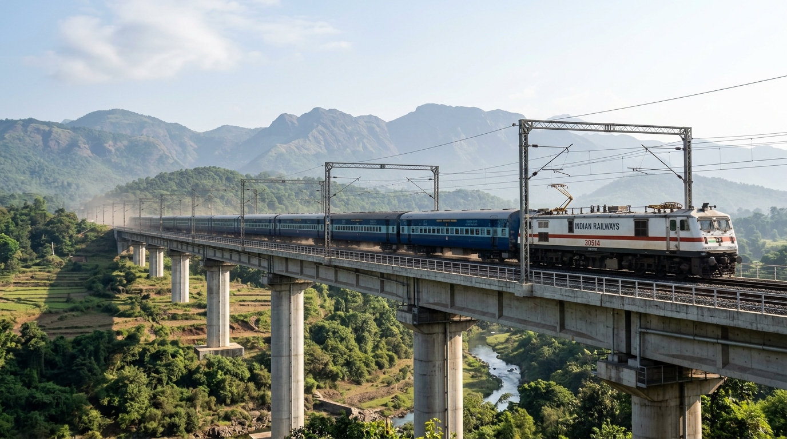
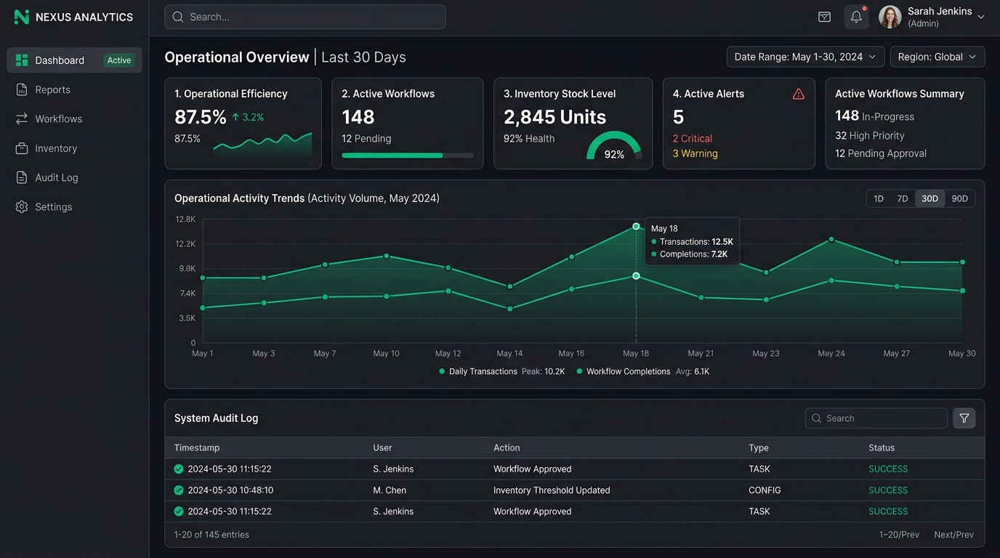

# Soumik Ghosh — Engineering Portfolio

[](https://nextjs.org/)
[](https://react.dev/)
[](https://www.typescriptlang.org/)
[](https://tailwindcss.com/)
[](https://greensock.com/gsap/)
[](LICENSE)

A high-performance personal engineering portfolio showcasing real-world embedded firmware, industrial IoT systems, and full-stack operational platforms developed by **Soumik Ghosh**.


---

## Overview

This repository contains the complete source code for Soumik Ghosh's engineering portfolio. Built with **Next.js 16**, **React 19**, and **TypeScript**, the site highlights verified engineering projects spanning:

- **Embedded Systems & Firmware**: Microcontroller architectures (STM32, ESP32-S3), FreeRTOS task scheduling, low-power sleep management, and sensor driver development.
- **Industrial IoT & Telemetry**: Cellular Cat-1 / 4G telemetry units, Modbus RTU communication, GNSS navigation decoding, and secure MQTT over TLS.
- **Full-Stack Systems & Operational Tools**: Next.js and React enterprise applications, double-entry inventory engines, executive dashboards, and progressive web apps (PWAs).

The portfolio emphasizes practical engineering outcomes, real constraints, hardware-software integration, and verifiable project evidence over generic skill meters.

---

## Live Website

- **Production URL**: [https://soumik-ghosh-portfolio.vercel.app](https://soumik-ghosh-portfolio.vercel.app) *(or deployed Vercel domain)*
- **Primary Domain**: Deployable directly to any Vercel domain or custom domain without code modifications.

---

## Features

- **Responsive Portfolio**: Fully responsive across mobile smartphones, tablets, laptops, and ultra-wide desktop displays.
- **Comprehensive Project Showcase**: Multi-category filterable directory organizing projects across Embedded Systems, Industrial IoT, Full-Stack Applications, Dashboards & Tools, and Geospatial & Web.
- **Dedicated Project Case Studies**: 8 in-depth case study routes (`/projects/[slug]`) documenting real system architecture, hardware/software specifications, engineering highlights, and measurable outcomes.
- **Dedicated About Page**: Comprehensive professional profile detailing engineering background, firmware and software competencies, and engineering philosophies.
- **Interactive Contact Section**: Direct communication portal with verified email, GitHub, and LinkedIn profiles.
- **Smooth Navigation & Transitions**: Streamlined top navigation bar (`Overview | Projects | About | Contact`) with mobile drawer menu and fluid GSAP route transitions.
- **Back-to-Top Interaction**: Subtle, context-aware back-to-top button with circular scroll-depth progress ring.
- **SEO & Social Sharing Ready**: Dynamically generated Open Graph preview card (`/opengraph-image`), Twitter card metadata, `robots.txt`, and automated `sitemap.xml`.

---

## Projects

All 8 featured projects represent verified systems built and tested by Soumik Ghosh:

| Project | Category | Purpose | Core Technologies | Links |
|---|---|---|---|---|
| **Panorama Water Tank Monitor** | Industrial SCADA & IoT | Multi-tier industrial water tank monitoring system pairing an ESP32-S3 cellular 4G telemetry unit with a desktop Qt 6 / QML SCADA console. | ESP32-S3, Qt 6, QML, C++, FreeRTOS, 4G LTE, MQTT | [Case Study](/projects/panorama-water-tank) · [GitHub](https://github.com/soumikbur/PanoramaWaterTank) |
| **Railway Water Level Indicator & Telemetry** | Autonomous Telemetry | Autonomous, ultra-low-power ARM Cortex-M4 telemetry node for remote trackside drainage and water installations with satellite positioning. | STM32, FreeRTOS, ARM Cortex-M4, Quectel 4G LTE, GNSS, MQTT/TLS | [Case Study](/projects/railway-telemetry-wli) · [GitHub](https://github.com/soumikbur) |
| **Industrial Substation Asset Monitor** | Industrial Embedded & IIoT | Non-volatile telemetry logger and multi-sensor diagnostic monitor for substation transformers, tap-changers, and power meters. | STM32, Modbus RTU, SPI NOR Flash, FATFS, Power Meter, MQTT | [Case Study](/projects/industrial-asset-monitor) · [GitHub](https://github.com/soumikbur) |
| **ApexFlow Inventory & Order Management** | Enterprise Operations | Full-stack operations platform featuring double-entry stock ledger, 5-stage order fulfillment state machine, and multi-tier RBAC. | Next.js, React, TypeScript, Node.js, PostgreSQL, Prisma, Docker | [Case Study](/projects/apexflow) · [GitHub](https://github.com/soumikbur) |
| **Business Analytics & Operations Dashboard** | Analytics & Internal Tools | Real-time executive performance dashboard delivering sub-100ms KPI computations, visual charts, and administrative audit trails. | Next.js 16, React 19, Prisma, PostgreSQL, NextAuth v5, Tailwind CSS | [Case Study](/projects/business-dashboard) · [GitHub](https://github.com/soumikbur/business-admin-dashboard) |
| **PujoPath Kolkata Metro Transit PWA** | Geospatial & Web | Progressive web application providing interactive GIS route mapping and offline transit navigation across Kolkata Metro corridors. | Next.js, React, Leaflet GIS, OpenStreetMap, PWA, Service Workers | [Case Study](/projects/pujopath) · [GitHub](https://github.com/soumikbur) |
| **Transparent Supply Chain Platform** | Distributed Systems & Web3 | Decentralized product traceability platform maintaining immutable chain-of-custody and tamper-evident document storage. | Solidity, Ethereum, IPFS, React.js, Web3.js | [Case Study](/projects/transparent-supply-chain) · [GitHub](https://github.com/soumikbur/AI-enabled-Decentralized-SupplyChain) |
| **Sarvak AI Safety Platform** | Emergency Response & Mobile | Real-time incident response and automated distress tracking platform developed for Smart India Hackathon public safety challenges. | React, Flutter, Firebase, Computer Vision, Telemetry | [Case Study](/projects/sarvak-safety-platform) · [GitHub](https://github.com/soumikbur) |

---

## Technology Stack

The portfolio is built with modern, production-grade web technologies:

- **Framework**: [Next.js 16](https://nextjs.org/) (App Router, Server Components, Route Handlers)
- **UI Library**: [React 19](https://react.dev/)
- **Language**: [TypeScript 5](https://www.typescriptlang.org/) (Strict type checking)
- **Styling**: [Tailwind CSS v4](https://tailwindcss.com/) with custom dark design tokens
- **Animations**: [GSAP 3.15](https://greensock.com/gsap/) (Route transitions and subtle entrance motion)
- **Icons**: [Lucide React](https://lucide.dev/)
- **SEO & Metadata**: Dynamic Open Graph generation via `next/og`, `sitemap.ts`, `robots.ts`

---

## Project Structure

```text
portfolio/
├── public/                     # Static public assets
│   ├── images/
│   │   ├── og-preview.png      # High-res social sharing Open Graph banner
│   │   ├── soumik-ghosh.jpg    # Verified developer profile photograph
│   │   └── projects/           # High-resolution project imagery & hardware diagrams
│   └── favicon.ico             # Site favicon
├── src/
│   ├── app/                    # Next.js App Router routes & pages
│   │   ├── layout.tsx          # Root layout with navbar, footer, and back-to-top
│   │   ├── page.tsx            # Homepage / Overview
│   │   ├── about/              # Dedicated About page
│   │   ├── contact/            # Dedicated Contact page
│   │   ├── projects/           # Projects index page & category filters
│   │   │   └── [slug]/         # Dynamic case study route handler
│   │   ├── opengraph-image.tsx # Dynamic Open Graph card generator
│   │   ├── robots.ts           # Search engine crawler configuration
│   │   └── sitemap.ts          # XML sitemap generator
│   ├── components/             # Reusable UI & architectural components
│   │   ├── Navbar.tsx          # Responsive navigation bar with mobile drawer
│   │   ├── Footer.tsx          # Site footer with direct links & copyright
│   │   ├── PageTransition.tsx  # GSAP route-transition manager
│   │   ├── BackToTop.tsx       # Contextual back-to-top scroll trigger
│   │   └── ProjectCard.tsx     # Standardized project showcase card
│   └── lib/                    # Shared data models & utility functions
│       └── data/
│           └── projects.ts     # Complete verified project database & metadata
├── .gitignore                  # Git ignore rules (node_modules, .next, .env*)
├── LICENSE                     # MIT License
├── package.json                # Project dependencies and run scripts
├── tsconfig.json               # TypeScript strict configuration
└── README.md                   # Repository documentation
```

---

## Running Locally

### Prerequisites

- **Node.js**: `v18.18.0` or later (Node.js 20+ recommended)
- **npm**: `v9.0.0` or later

### Installation

1. Clone the repository:
   ```bash
   git clone https://github.com/soumikbur/soumik-ghosh-portfolio.git
   cd soumik-ghosh-portfolio
   ```

2. Install dependencies:
   ```bash
   npm install
   ```

3. Start the local development server:
   ```bash
   npm run dev
   ```
   Open [http://localhost:3000](http://localhost:3000) in your browser to view the application.

4. Run code quality checks:
   ```bash
   npm run lint
   ```

5. Test production build:
   ```bash
   npm run build
   npm run start
   ```

---

## Deployment

The application is pre-configured for automated deployment on **Vercel**:

### Automated Deployment via GitHub

1. Import the repository in [Vercel Dashboard](https://vercel.com/new).
2. Framework preset will automatically detect **Next.js**.
3. (Optional) Define the environment variable:
   - `NEXT_PUBLIC_SITE_URL`: Set to your production domain (e.g., `https://soumik-ghosh-portfolio.vercel.app`).
4. Click **Deploy**. Vercel will run `npm run build` and provision an edge-cached static deployment.

### Manual Deployment via Vercel CLI

```bash
# Log in to Vercel
npx vercel

# Deploy directly to production
npx vercel --prod
```

---

## Images / Screenshots

Key visuals hosted within the repository:

| Asset | Preview | Description |
|---|---|---|
| **Open Graph Banner** |  | Social preview card for sharing on LinkedIn, Twitter, and messaging platforms. |
| **Profile Photo** |  | Verified professional profile photo of Soumik Ghosh. |
| **Panorama Water Tank** |  | ESP32-S3 4G telemetry unit and Qt 6 / QML industrial SCADA console. |
| **Business Dashboard** |  | High-performance operational analytics and executive KPI scorecard view. |

---

## Design / UX

- **Technical Engineering Aesthetic**: Styled with a deliberate deep-slate palette (`#07090e` background with slate borders and subtle cyan-teal highlights) designed to reflect industrial and firmware precision.
- **Restrained Motion**: Subtle micro-interactions and smooth GSAP route transitions that enhance user navigation without unnecessary visual clutter.
- **Responsive Layout**: Designed mobile-first, ensuring high legibility and touch-friendly controls across all screen form factors.
- **Focus on Verifiable Systems**: Clear architectural diagrams, pinouts, protocols, and data models prioritize tangible technical competence over generic skill bars.

---

## License

This project is licensed under the **MIT License** — see the [LICENSE](LICENSE) file for details.
