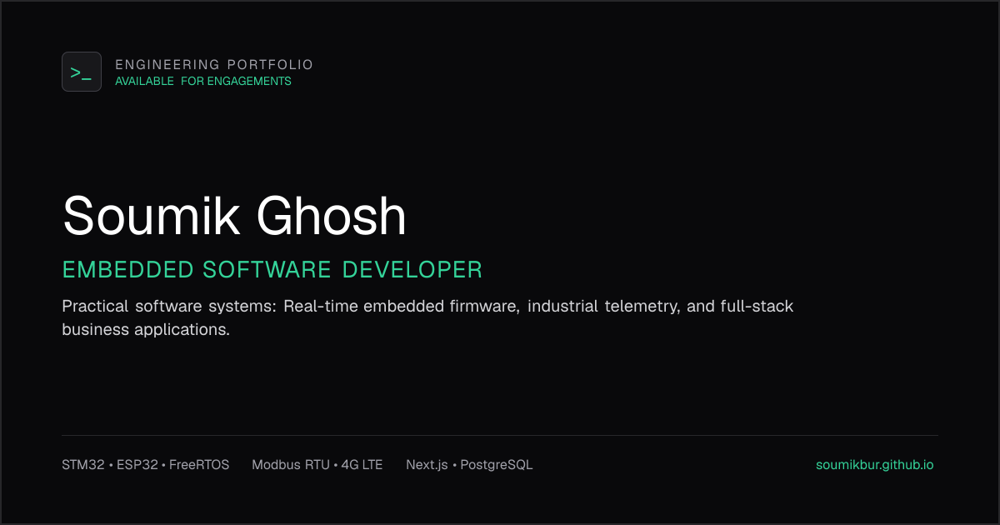

# Soumik Ghosh — Engineering Portfolio

Personal engineering portfolio for **Soumik Ghosh**, an Embedded Software Developer focused on embedded systems, industrial IoT, firmware, and practical software applications.

The portfolio presents selected engineering projects through concise case studies, screenshots, technical highlights, and links to available source repositories.

## Live Portfolio

**Website:** https://soumik-ghosh-portfolio.vercel.app


## About

I build practical software systems that solve real operational and engineering problems.

My work spans embedded firmware, real-time systems, industrial telemetry, IoT applications, dashboards, and full-stack software.

The portfolio focuses on the engineering problem, the resulting system, and the technologies used rather than generic skill ratings.

## Featured Projects

The portfolio currently showcases the following projects:

| Project                                   | Area                        | Technologies                                     |
| ----------------------------------------- | --------------------------- | ------------------------------------------------ |
| Panorama Water Tank Monitor               | Industrial IoT / SCADA      | ESP32, Qt, QML, C++, FreeRTOS, LTE, MQTT         |
| Railway Water Level Indicator & Telemetry | Embedded / IoT              | STM32, FreeRTOS, LTE, GNSS, MQTT/TLS             |
| Industrial Substation Asset Monitor       | Embedded / IIoT             | STM32, Modbus RTU, SPI Flash, FATFS, MQTT        |
| ApexFlow Inventory & Order Management     | Full-Stack / Operations     | Next.js, React, TypeScript, PostgreSQL, Prisma   |
| Business Analytics & Operations Dashboard | Analytics / Internal Tools  | Next.js, React, Prisma, PostgreSQL, Tailwind CSS |
| PujoPath Kolkata Metro Transit PWA        | Geospatial / Web            | Next.js, React, Leaflet, OpenStreetMap, PWA      |
| Transparent Supply Chain Platform         | Distributed Systems / Web3  | Solidity, Ethereum, IPFS, React, Web3.js         |
| Sarvak AI Safety Platform                 | Emergency Response / Mobile | React, Flutter, Firebase, Computer Vision        |

Project availability, repository links, and case-study links are maintained on the portfolio website.

## Portfolio Features

* Responsive design for mobile, tablet, and desktop
* Project directory with category-based organization
* Individual project case studies
* Dedicated About and Contact pages
* GitHub and LinkedIn integration
* Responsive navigation
* Smooth page transitions
* Back-to-top interaction
* Open Graph metadata for link sharing
* Sitemap and robots configuration
* Static project and profile imagery hosted with the application

## Technology Stack

The portfolio is built with:

* **Next.js**
* **React**
* **TypeScript**
* **Tailwind CSS**
* **GSAP**
* **Lucide React**

The project uses the Next.js App Router and keeps reusable UI components and project data separated from individual route implementations.

## Project Structure

```text
soumik-ghosh-portfolio/
├── public/
│   └── images/
│       ├── soumik-ghosh.jpg
│       ├── og-preview.png
│       └── projects/
│
├── src/
│   ├── app/
│   │   ├── about/
│   │   ├── contact/
│   │   ├── projects/
│   │   │   └── [slug]/
│   │   ├── opengraph-image.tsx
│   │   ├── robots.ts
│   │   ├── sitemap.ts
│   │   └── page.tsx
│   │
│   ├── components/
│   └── lib/
│       └── data/
│
├── package.json
├── next.config.ts
├── tsconfig.json
├── eslint.config.mjs
├── LICENSE
└── README.md
```

The exact structure may evolve as the portfolio is maintained.

## Run Locally

### Requirements

* Node.js 18.18 or later
* npm

### Clone

```bash
git clone https://github.com/soumikbur/soumik-ghosh-portfolio.git
cd soumik-ghosh-portfolio
```

### Install dependencies

```bash
npm install
```

### Start development server

```bash
npm run dev
```

Open:

```text
http://localhost:3000
```

### Lint

```bash
npm run lint
```

### Production build

```bash
npm run build
```

### Start production server

```bash
npm run start
```

## Deployment

The portfolio is designed for deployment on **Vercel** or another platform that supports Next.js.

For Vercel:

1. Import the GitHub repository.
2. Allow Vercel to detect the Next.js configuration.
3. Configure any required production environment variables.
4. Deploy the application.
5. Update the Live Portfolio URL in this README if the deployment domain changes.

The application should not depend on a local machine, localhost address, or private network address after deployment.

## Screenshots

Portfolio screenshots and project imagery are stored in the repository under:

```text
public/images/
public/images/projects/
```

When adding screenshots to this README, use repository-hosted paths so they render correctly on GitHub.

Example:

```md

```

Additional project screenshots can be added here as the portfolio evolves.

## Design Approach

The interface uses a dark, technical visual language intended to reflect engineering and systems work.

The design emphasizes:

* Clear typography
* Strong information hierarchy
* Controlled motion
* Responsive layouts
* Technical project imagery
* Minimal decorative effects
* Project evidence over generic skill meters

Animations are used to support navigation and interaction rather than dominate the interface.

## Contact

**Soumik Ghosh**
Embedded Software Developer

* Email: [soumik.bur@gmail.com](mailto:soumik.bur@gmail.com)
* GitHub: https://github.com/soumikbur
* LinkedIn: https://www.linkedin.com/in/soumik-ghosh-883a1a22b/

## Repository

**GitHub:**
https://github.com/soumikbur/soumik-ghosh-portfolio

## License

This repository is licensed under the MIT License. See [`LICENSE`](./LICENSE) for details.
