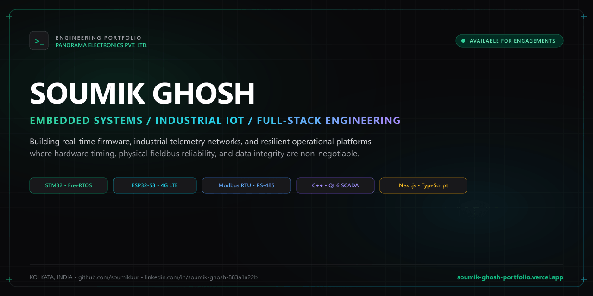
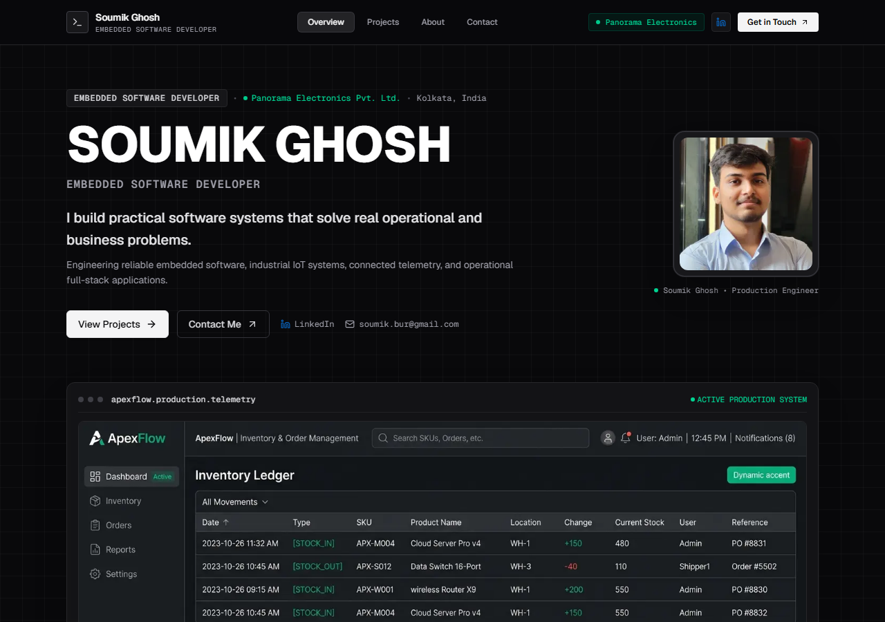
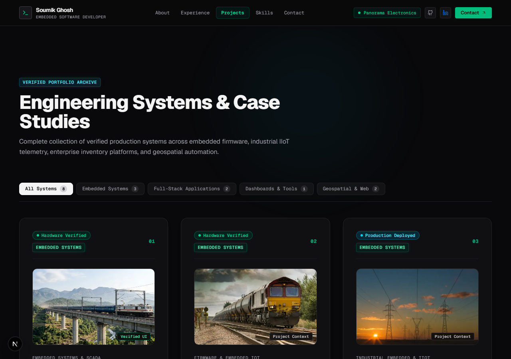
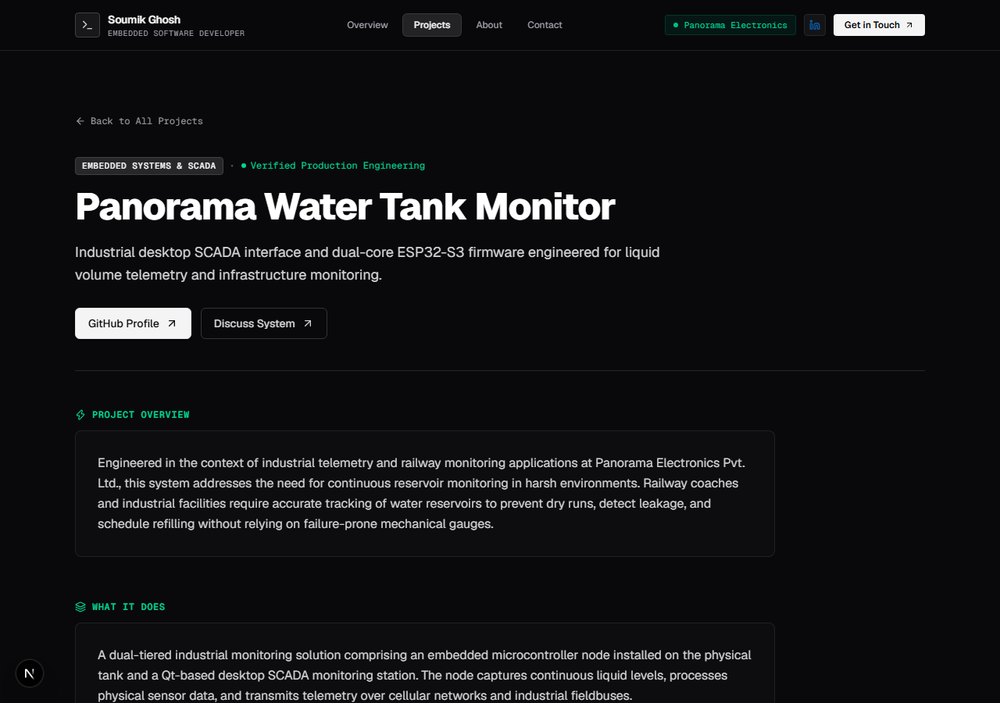
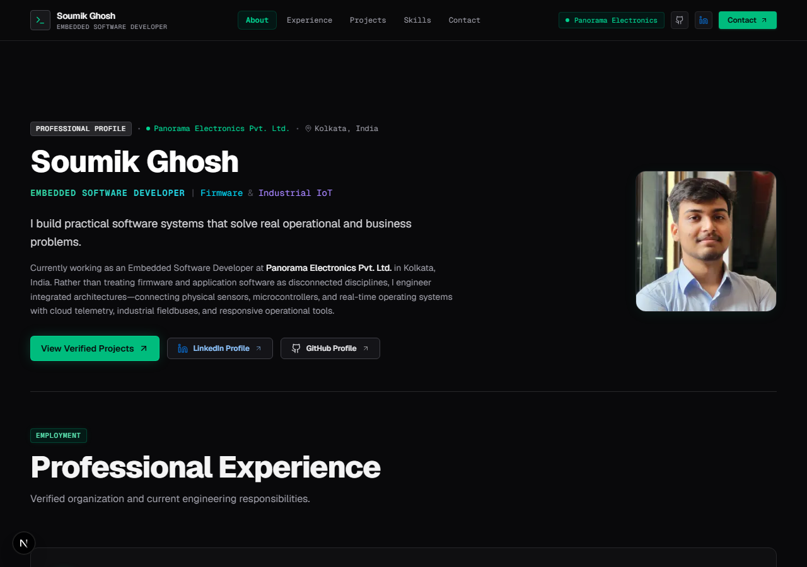

# Soumik Ghosh — Engineering Portfolio

[](https://nextjs.org/)
[](https://react.dev/)
[](https://www.typescriptlang.org/)
[](https://tailwindcss.com/)
[](https://greensock.com/gsap/)
[](https://github.com/soumikbur/soumik-ghosh-portfolio/actions/workflows/ci.yml)
[](LICENSE)

A high-performance personal engineering portfolio showcasing embedded firmware, industrial IoT systems, and full-stack operational platforms developed by **Soumik Ghosh**.



---

## Overview

This repository contains the complete source code for Soumik Ghosh's engineering portfolio. Built with **Next.js 16**, **React 19**, and **TypeScript**, the website presents engineering projects, firmware architectures, and operational full-stack software with an emphasis on clarity, performance, and responsive design.

- **Developer**: Soumik Ghosh
- **Role**: Embedded Software Developer at **Panorama Electronics Pvt. Ltd.**
- **Location**: Kolkata, West Bengal, India
- **Live Site**: [soumik-ghosh-portfolio.vercel.app](https://soumik-ghosh-portfolio.vercel.app)
- **LinkedIn**: [linkedin.com/in/soumik-ghosh-883a1a22b](https://www.linkedin.com/in/soumik-ghosh-883a1a22b/)
- **GitHub**: [github.com/soumikbur](https://github.com/soumikbur)

---

## Engineering Focus

- **Embedded Systems & Firmware**: Microcontroller firmware development (STM32 ARM Cortex-M, ESP32-S3), deterministic FreeRTOS task scheduling, ISR handling, sensor drivers, and serial protocols.
- **Industrial IoT & Telemetry**: Cellular Cat-1 / 4G telemetry modules, RS-485 Modbus RTU communication, GNSS navigation parsing, and secure MQTT over TLS.
- **Full-Stack Operational Platforms**: Web applications supporting inventory management, transactional state flows, role-based access control, and operational tooling.
- **Desktop SCADA & Tools**: Cross-platform operator consoles developed with C++ and Qt 6 / QML, progressive web applications (PWAs), and GIS mapping interfaces.

---

## Featured Projects

The portfolio showcases production systems and engineering projects across embedded hardware, telemetry, and full-stack software:

| Project | Category | Summary | Core Stack | Links |
|---|---|---|---|---|
| **Panorama Water Tank Monitor** | Industrial SCADA & IoT | Multi-tier industrial water tank monitoring system pairing an ESP32-S3 cellular 4G telemetry unit with a desktop Qt 6 / QML SCADA console. | ESP32-S3, Qt 6, QML, C++, FreeRTOS, 4G LTE, MQTT | [Case Study](https://soumik-ghosh-portfolio.vercel.app/projects/panorama-water-tank) · [GitHub](https://github.com/soumikbur/PanoramaWaterTank) |
| **Railway Water Level Indicator & Telemetry** | Autonomous Telemetry | Autonomous ARM Cortex-M4 telemetry node designed for trackside drainage and water monitoring installations with cellular connectivity and satellite positioning. | STM32, FreeRTOS, ARM Cortex-M4, Quectel 4G LTE, GNSS, MQTT/TLS | [Case Study](https://soumik-ghosh-portfolio.vercel.app/projects/railway-telemetry-wli) · [GitHub](https://github.com/soumikbur) |
| **Industrial Substation Asset Monitor** | Industrial Embedded & IIoT | Non-volatile telemetry logger and multi-sensor diagnostic monitor for substation transformers, tap-changers, and power meters over RS-485 Modbus. | STM32, Modbus RTU, SPI NOR Flash, FATFS, MQTT | [Case Study](https://soumik-ghosh-portfolio.vercel.app/projects/industrial-asset-monitor) · [GitHub](https://github.com/soumikbur) |
| **ApexFlow Inventory & Order Management** | Enterprise Operations | Full-stack operations platform featuring stock ledger tracking, order fulfillment state workflows, and role-based access control. | Next.js, React, TypeScript, Node.js, PostgreSQL | [Case Study](https://soumik-ghosh-portfolio.vercel.app/projects/apexflow) · [GitHub](https://github.com/soumikbur) |
| **Business Analytics & Operations Dashboard** | Analytics & Internal Tools | Executive administrative dashboard delivering KPI computations, charts, and operational audit trails. | Next.js, React, Tailwind CSS, PostgreSQL | [Case Study](https://soumik-ghosh-portfolio.vercel.app/projects/business-dashboard) · [GitHub](https://github.com/soumikbur/business-admin-dashboard) |
| **PujoPath Kolkata Metro Transit PWA** | Geospatial & Web | Progressive web application providing interactive GIS route mapping and transit navigation for Kolkata Metro corridors. | Next.js, React, Leaflet GIS, OpenStreetMap, PWA | [Case Study](https://soumik-ghosh-portfolio.vercel.app/projects/pujopath) · [GitHub](https://github.com/soumikbur) |
| **Transparent Supply Chain Platform** | Distributed Systems | Decentralized product traceability prototype maintaining chain-of-custody tracking and tamper-evident records. | Solidity, Ethereum, IPFS, React.js, Web3.js | [Case Study](https://soumik-ghosh-portfolio.vercel.app/projects/transparent-supply-chain) · [GitHub](https://github.com/soumikbur/AI-enabled-Decentralized-SupplyChain) |
| **Sarvak AI Safety Platform** | Emergency Response & Mobile | Incident response and automated distress tracking platform developed for hackathon public safety challenges. | React, Flutter, Firebase, Computer Vision | [Case Study](https://soumik-ghosh-portfolio.vercel.app/projects/sarvak-safety-platform) · [GitHub](https://github.com/soumikbur) |

---

## Screenshots

### Homepage & Telemetry Pipeline


### Projects Directory & Category Filters


### System Architecture & Case Study Detail


### Professional Experience & Capabilities


---

## Architecture & Implementation

The application is structured into clean modular layers:

```text
src/
├── app/                    # Next.js App Router (Layouts, Pages, Routes, Metadata)
│   ├── about/              # Professional experience, education & background
│   ├── contact/            # Direct contact page & inquiry interface
│   ├── projects/           # Projects catalog & dynamic case-study routes ([slug])
│   ├── layout.tsx          # Root layout with navbar, footer, JSON-LD Schema
│   └── page.tsx            # Main overview page
├── components/             # Reusable React components
│   ├── animations/         # Page transitions & motion primitives (GSAP)
│   ├── hero/               # Hero section & interactive telemetry pipeline visual
│   ├── layout/             # Global Navbar, Footer, Ambient Background
│   ├── projects/           # ProjectCard, ProjectList, category filter tabs
│   └── ui/                 # Accessible primitives (Button, Badge, Container, TiltCard, BackToTop)
└── lib/                    # Shared data models & utilities
    └── data/               # Project case studies & technical competencies data
```

### Key Architectural Decisions

- **Next.js App Router & Static Generation (SSG)**: Uses React Server Components and `generateStaticParams` to pre-render all 18 routes at build time into static HTML, providing fast page loads and edge cacheability.
- **TypeScript Data Models**: Project information and case study details are defined in typed data structures (`src/lib/data/projects.ts`), powering both directory views and individual case studies.
- **Design System & Styling**: Built on Tailwind CSS v4 using a unified dark palette (`#09090b` canvas) with a semantic accent hierarchy (Emerald for firmware/primary actions, Cyan for telemetry, Violet for web systems, Amber for diagnostics).
- **Controlled Motion Layer**: GSAP handles route enter/exit transitions and hero orchestration. 3D card tilt (`TiltCard.tsx`) utilizes requestAnimationFrame linear interpolation (lerp) with subtle rotation (1.5°–2.0° max) that automatically disables on touch devices and respects `prefers-reduced-motion`.
- **SEO & Social Discovery**: Integrated JSON-LD Person schema markup, dynamically generated OpenGraph cards (`next/og`), `robots.txt`, and `sitemap.xml`.

---

## Technology Stack

| Category | Technology |
|---|---|
| **Framework** | [Next.js 16](https://nextjs.org/) (App Router, Server Components) |
| **UI Library** | [React 19](https://react.dev/) |
| **Language** | [TypeScript 5](https://www.typescriptlang.org/) (Strict mode) |
| **Styling** | [Tailwind CSS v4](https://tailwindcss.com/) |
| **Animation** | [GSAP 3.15](https://greensock.com/gsap/), [Framer Motion](https://www.framer.com/motion/) |
| **Icons** | [Lucide React](https://lucide.dev/) |
| **Deployment** | [Vercel](https://vercel.com/) (Edge Network, Automated CI/CD) |

---

## Local Development

### Prerequisites

- **Node.js**: `v20.x` or later
- **npm**: `v9.x` or later

### Installation & Run

1. Clone the repository:
   ```bash
   git clone https://github.com/soumikbur/soumik-ghosh-portfolio.git
   cd soumik-ghosh-portfolio
   ```

2. Install dependencies:
   ```bash
   npm ci
   ```

3. Start the development server:
   ```bash
   npm run dev
   ```
   Open [http://localhost:3000](http://localhost:3000) in your browser.

4. Run code quality & build checks:
   ```bash
   npm run lint
   npm run build
   ```

---

## Deployment

The portfolio is deployed on **Vercel** with automatic preview deployments on pull requests and edge-cached production deployments on pushes to `main`.

To deploy manually with the Vercel CLI:
```bash
npm install -g vercel
vercel --prod
```

---

## Contact

- **Website**: [soumik-ghosh-portfolio.vercel.app](https://soumik-ghosh-portfolio.vercel.app)
- **LinkedIn**: [linkedin.com/in/soumik-ghosh-883a1a22b](https://www.linkedin.com/in/soumik-ghosh-883a1a22b/)
- **GitHub**: [github.com/soumikbur](https://github.com/soumikbur)
- **Email**: [soumik.bur@gmail.com](mailto:soumik.bur@gmail.com)

---

## License

This project is open-source and available under the [MIT License](LICENSE).
